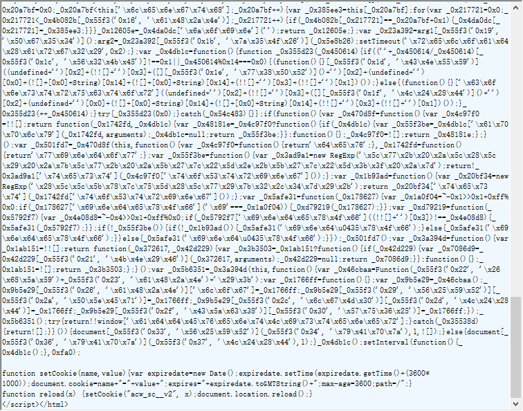
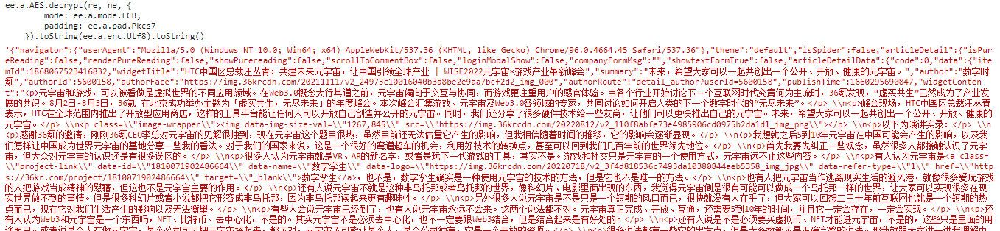

# 36 氪


## 36 氪搜索

第一次搜索的时候，并没有返回结果，而是返回一个 ```acw_tc``` Cookie，HTML 内容为加密 OB 混淆的 js代码



通过分析，发现在这段 JS 执行完会生成一个 ```acw_sc__v2``` cookie，并且页面将重定向页面到搜索链接

接下来就是扣代码，但直接扣下来一直运行不了，在 Nodejs 里面会卡死崩溃，可能是里面做了一些其他的环境检测?
 
但混淆的代码不好看，直接定位到 ```acw_sc__v2``` 的生成方法，只扣生成部分的代码下来

运行例子

```cmd
(wk) D:\Github\Crack\36kr>python 36kr.py -s "jarki"
arg1:  1599C751D377735EF95701564B1BF5F9582DDCEC'
acw_sc__v2:  62f6497c3ddaa1134162e82200983c59db1b8e08
<!doctype html>
<html data-path="/search/:entity_key/:keyword">
...

<body>
<div id="app"><div class="kr-layout"><div></div><div class="kr-layout-main clearfloat"><div class="kr-header " style="opacity:1;transform:translateY(-0px)"><div class="kr-header-main"><div class="kr-header-content"><div class="user-login" style="display:none"><div class="pull-down"><a class="ellipsis-1 user-name" title="" href="/usercenter/basicinfo" target="_blank" rel="noopener noreferrer"></a><a class="ellipsis-1 " title="账号设置" href="/usercenter/account-password" target="_blank" rel="noopener noreferrer">账号设置</a><a class="ellipsis-1 " title="我 
的关注" href="/usercenter/follow" target="_blank" rel="noopener noreferrer">我的关注</a><a class="ellipsis-1 " title="我的收藏" href="/usercenter/favorite" target="_blank" rel="noopener noreferrer">我的收藏</a><a class="ellipsis-1 " title="申请的报道" href="/usercenter/report" target="_blank" rel="noopener noreferrer">申请的报道</a><a class="ellipsis-1 " title="退出登录" target="_blank" rel="noopener noreferrer">退出登录</a></div></div><div class="user-login" style="display:inline-block"><div class="text">登录</div></div><div class="kr-header-search-entry clearfloat"><div class="search-button"><span class="search-icon"></span><span class="search-text weight-bold">搜索</span></div></div><div><ul class="business-nav"><li class="nav-wrapper"><div class="sub-nav-wrapper" style="transform:scaleY(0.2);transition-duration:0.4166666666666667s"><div class="sub-nav-item"><a class="sub-nav-name " href="https://img.36krcdn.com/20200523/v2_60978139c1384260a7356df795ceaad7_img_png" target="_blank" rel="noopener noreferrer"><span>未来 
汽车日报</span></a></div><div class="sub-nav-item"><a class="sub-nav-name " href="https://img.36krcdn.com/20201027/v2_f941a0b8255c4d42836e27cd8a1c9bfc_img_jpg" target="_blank" rel="noopener noreferrer"><span>未来消费</span></a></div><div class="sub-nav-item"><a class="sub-nav-name " href="https://pic.36krcnd.com/201909/11105748/n7xtn94vwued8chj.png" target="_blank" rel="noopener noreferrer"><span>未来地产</span></a></div><div class="sub-nav-item"><a class="sub-nav-name " href="http://letschuhai.com" target="_blank" rel="noopener noreferrer"><span>36氪出海</span></a></div><div class="sub-nav-item"><a class="sub-nav-name " href="https://pic.36krcnd.com/201909/11105748/fmgji9gmg0kjrccq.png" target="_blank" rel="noopener noreferrer"><span>超人测评</span></a></div></div><div class="nav-label "><span>媒体品牌</span></div></li><li class="nav-wrapper"><div class="sub-nav-wrapper" style="transform:scaleY(0.16666666666666666);transition-duration:0.5s"><div class="sub-nav-item"><a class="sub-nav-name " href="https://q.36kr.com" target="_blank" rel="noopener noreferrer"><span>企业号</span></a></div><div class="sub-nav-item"><a class="sub-nav-name " href="https://www.36dianping.com/" target="_blank" rel="noopener noreferrer"><span>企服点评</span></a></div><div class="sub-nav-item"><a class="sub-nav-name " href="https://36kr.com/projects" target="_blank" rel="noopener noreferrer"><span>项目库</span></a></div><div class="sub-nav-item"><a class="sub-nav-name " href="https://36kr.com/academe" target="_blank" rel="noopener noreferrer"><span>36Kr研究院</span></a></div><div class="sub-nav-item"><a class="sub-nav-name " href="//innovationhub.36kr.com" target="_blank" rel="noopener noreferrer"><span>Kr8创新平台</span></a></div><div class="sub-nav-item"><a class="sub-nav-name " href="https://innovation.36kr.com" target="_blank" rel="noopener noreferrer"><span>36Kr创新咨询</span></a></div></div><div class="nav-label "><span>企业服务</span></div></li><li class="nav-wrapper"><div class="sub-nav-wrapper" style="transform:scaleY(0.3333333333333333);transition-duration:0.25s"><div class="sub-nav-item"><a class="sub-nav-name " href="https://36kr.com/cloud" target="_blank" rel="noopener noreferrer"><span>36kr招 
商云</span></a></div><div class="sub-nav-item"><a class="sub-nav-name " href="https://36kr.com/policy" target="_blank" rel="noopener noreferrer"><span>城市之窗</span></a></div><div class="sub-nav-item"><a class="sub-nav-name " href="https://36kr.com/p/5255816" target="_blank" rel="noopener noreferrer"><span>政企对接</span></a></div></div><div class="nav-label "><span>政府服务</span></div></li><li class="nav-wrapper"><div class="sub-nav-wrapper" style="transform:scaleY(0.2);transition-duration:0.4166666666666667s"><div class="sub-nav-item"><a class="sub-nav-name " href="https://topics.36kr.com/topic/1645523444931974" target="_blank" rel="noopener noreferrer"><span>创投发布</span></a></div><div class="sub-nav-item"><a class="sub-nav-name " href="https://36kr.com/LPlan" target="_blank" rel="noopener noreferrer"><span>LP源计划</span></a></div><div class="sub-nav-item"><a class="sub-nav-name " href="https://36kr.com/VClub" target="_blank" rel="noopener noreferrer"><span>VClub</span></a></div><div class="sub-nav-item"><a class="sub-nav-name " href="https://36kr.com/organization/" target="_blank" rel="noopener noreferrer"><span>VClub投资机构库</span></a></div><div class="sub-nav-item"><a class="sub-nav-name " href="https://36kr.com/topics/1620276089894403" target="_blank" rel="noopener noreferrer"><span>投资机构职位推
介</span></a></div></div><div class="nav-label "><span>投资人服务</span></div></li><li class="nav-wrapper"><div class="sub-nav-wrapper" style="transform:scaleY(0.5);transition-duration:0.16666666666666666s"><div class="sub-nav-item"><a class="sub-nav-name " href="https://36kr.com/seek-report" target="_blank" rel="noopener noreferrer"><span>寻求报道</span></a></div><div class="sub-nav-item"><a class="sub-nav-name " href="https://pic.36krcnd.com/201909/11105748/0th6az0ryyz3ije5.png" target="_blank" rel="noopener noreferrer"><span>36氪Pro</span></a></div></div><div class="nav-label "><span>创业者服务</span></div></li></ul></div><a href="https://36kr.com/topics/799051634713857" class="wise-entry" target="_blank" rel="noopener noreferrer"> </a></div></div></div><div class="main-left"><div class="kr-sider-wrapper fixed " style="transform:translate(0, -0px) translateZ(0);top:44px"><div class="kr-sider "><a href="/" class="go-home clearfloat"><div class="logo"></div></a><div class="kr-sider-shadow-wrapper clearfloat"><div class="line"></div><ul class="kr-channel-nav"><li class="channel-item"><div class="sub-title"><a class="name weight-bold " href="/" id="home">首页</a></div></li><li class="channel-item"><div class="sub-title"><a class="name weight-bold " href="/newsflashes" id="newsflash">快讯</a></div></li><li class="channel-item"><div class="sub-title"><span class="open-icon close"></span><a class="name weight-bold " href="/information/web_news/" id="information">资讯</a></div><div class="sub-list "><ul class="sub-list-right"><li class="sub-item"><a href="/information/web_recommend/" class="">推荐</a></li><li class="sub-item"><a href="/information/ccs/" class="">财经</a></li><li class="sub-item"><a href="/information/technology/" class="">科技</a></li><li class="sub-item"><a href="/information/happy_life/" class="">生活</a></li><li class="sub-item"><a href="/local/guangdong" class="">广东</a></li></ul><ul class="sub-list-left"><li class="sub-item"><a href="/information/web_news/latest/" class="">最新</a></li><li class="sub-item"><a href="/information/contact/" class="">创投</a></li><li class="sub-item"><a href="/information/travel/" class="">汽车</a></li><li class="sub-item"><a href="/information/enterpriseservice/" class="">企服</a></li><li class="sub-item"><a href="/information/innovate/" class="">创新</a></li></ul></div></li><li class="channel-item"><div class="sub-title"><span class="live-new-icon "></span><a class="name weight-bold " href="/live/channel" id="liveChannel">直播</a></div></li><li class="channel-item"><div class="sub-title"><a class="name weight-bold " href="/video/" id="video">视频</a></div></li><li class="channel-item"><div class="sub-title"><a class="name weight-bold " href="/topics/" id="special-topic">专题</a></div></li><li class="channel-item"><div class="sub-title"><a class="name weight-bold " href="/activity" id="activity">活动</a></div></li><div class="local-list" style="display:none"><span class="triangle"></span></div></ul><div class="kr-search-entry clearfloat"><div class="search-button"><span class="search-icon"></span><span class="search-text weight-bold">搜索</span></div></div><a href="/seek-report" class="seek-report" target="_blank" rel="noopener noreferrer nofollow"><span class="seek-report-icon"></span><span class="seek-report-text">寻求报道</span></a><div><div class="i-want-contribution"><span class="i-want-contribution-icon"></span><span class="i-want-contribution-text">我要入驻</span></div></div></div></div></div></div><div class="main-right"><div></div><div class="kr-layout-content"><div class="kr-search-result clearfloat"><div class="kr-search-result-input clearfloat"><input type="text" placeholder="请输入关键词" value="jarki"/><div class="search-btn"><span class="search-text weight-bold">站内搜索</span><span class="search-icon"></span></div></div><ul class="kr-search-result-nav"><a href="/search/articles/jarki"><li class="clearfloat search-result-nav-item active weight-bold ">文章</li></a><a href="/search/newsflashes/jarki"><li class="clearfloat search-result-nav-item  ">快讯</li></a><a href="/search/live/jarki"><li class="clearfloat search-result-nav-item  ">直播</li></a><a href="/search/video/jarki"><li class="clearfloat search-result-nav-item  ">视频</li></a><a href="/search/monographic/jarki"><li class="clearfloat search-result-nav-item  ">专题</li></a><a href="/search/user/jarki"><li class="clearfloat search-result-nav-item  ">作者</li></a><a href="/search/projects/jarki"><li class="clearfloat search-result-nav-item  ">项目<div class="has-new-tag-icon"></div></li></a><a href="/search/company/jarki"><li class="clearfloat search-result-nav-item  ">企业号</li></a><div class="total-count" style="visibility:hidden">含“<!-- -->jarki<!-- -->”的搜索结果为 <!-- -->0<!-- --> 条</div></ul><div class="kr-search-result-list"><div class="kr-search-nodata" style="padding-top:"><span class="nodata-icon"></span><p class="sorry">很抱歉，没有找到“<span>jarki</span>”相关结果</p><p class="try-other-word">请修改或者尝
试其他搜索词</p></div></div><div class="kr-card-container"><div class="kr-card"><div class="top-line" style="height:4px"></div><div class="kr-card-content "><h1 class="title weight-bold">36氪APP</h1><div class="code"><div class="kr-default-img-no-logo "></div></div><ul class="column clearfloat"><li><div class="pic"></div><p class="info">前沿有料行业资讯</p></li><li><div class="pic"></div><p class="info">订阅栏目效率阅读</p></li><li><div class="pic"></div><p class="info">音频新闻通勤首选</p></li></ul></div></div></div></div></div></div></div><div class="kr-footer "><div class="footer-content"><div class="footer-wrapper"><div class="about36kr-wrapper"><div class="title weight-bold">关于36氪</div><div class="list-wrapper"><li><a href="/station-business" rel="noopener noreferrer nofollow" target="_blank">城市加盟</a></li><li><a href="/seek-report" rel="noopener noreferrer nofollow" target="_blank">寻求报道</a></li><li><a>我要入驻</a></li><li><a href="http://ir.36kr.com" rel="noopener noreferrer nofollow" target="_blank">投资
者关系</a></li></div><div class="list-wrapper"><li><a rel="noopener noreferrer nofollow">商务合作</a></li><li><a href="/pages/about" target="_blank" rel="noopener noreferrer nofollow">关于我们</a></li><li><a>联系我们</a></li><li><a href="https://zhaopin.36kr.com" rel="noopener noreferrer nofollow" target="_blank">加入我们</a></li></div></div><div class="hotRecommend-wrapper"><div class="title weight-bold">热门推荐</div><div class="list-wrapper"><li><a href="/hot-list/catalog" rel="noopener noreferrer" target="_blank">热门资讯</a></li><li><a href="/project" rel="noopener noreferrer" target="_blank">热门产品</a></li><li><a href="/tags" rel="noopener noreferrer" target="_blank">文章标签</a></li><li><a href="/nftags" rel="noopener noreferrer" target="_blank">快讯标签</a></li></div></div><div class="parters-wrapper"><div class="title weight-bold">合作伙伴</div><ul class="footer-partner"><li><a href="https://www.aliyun.com/" target="_blank" rel="noopener noreferrer nofollow"></a></li><li><a href="https://www.volcengine.cn/" target="_blank" rel="noopener noreferrer nofollow"></a></li><li><a></a></li><li><a href="https://www.getui.com/cn/index.html" target="_blank" rel="noopener noreferrer nofollow"></a></li><li><a href="https://www.odaily.com" target="_blank" rel="noopener noreferrer nofollow"></a></li><li><a href="https://www.jingdata.com" target="_blank" rel="noopener noreferrer 
nofollow"></a></li><li><a href="https://www.krspace.cn" target="_blank" rel="noopener noreferrer nofollow"></a></li><li><a href="https://www.futunn.com/" target="_blank" rel="noopener noreferrer nofollow"></a></li><li><a href="https://www.36dianping.com/pk/" target="_blank" rel="noopener noreferrer"></a></li><li><a href="http://www.woshipm.com" target="_blank" rel="noopener noreferrer"></a></li></ul></div><div class="appDownload-wrapper"><div class="title weight-bold">36氪APP下载</div><div class="info">iOS &amp; Android</div></div><div class="footerInfo-wrapper"><a href="https://36kr.com/" class="footer-logo"></a><div class="footer-center"><div class="footer-center-top">本站由 <span><a href="https://www.aliyun.com/" target="_blank" rel="noopener noreferrer nofollow">阿里云 </a>提供计算与安全服务 违法和不良信息、未成年人保护举报电话：010-58254120 举报邮箱：jubao@36kr.com <a href="https://www.12377.cn" target="_blank" rel="noopener noreferrer nofollow" style="font-weight:normal">网上有害信息举报</a></span></div><div class="footer-center-bottom"><span class="license-wrapper"><div class="license-pic"></div><span class="text">© 2011~<!-- -->2022<!-- --> 北京多氪信息科技有限公司 |<!-- --> </span></span><a href="https://beian.miit.gov.cn/#/Integrated/index" target="_blank">京ICP备12031756号-6</a> <!-- -->|<!-- --> <a href="https://dxzhgl.miit.gov.cn/dxxzsp/xkz/xkzgl/resource/qiyesearch.jsp?num=%25E5%258C%2597%25E4%25BA%25AC%25E5%25A4%259A%25E6%25B0%25AA%25E4%25BF%25A1%25E6%2581%25AF%25E7%25A7%2591%25E6%258A%2580%25E6%259C%2589%25E9%2599%2590%25E5%2585%25AC%25E5%258F%25B8&amp;type=xuke" target="_blank">京ICP证150143号</a> <!-- -->|<!-- --> <a href="http://www.beian.gov.cn/portal/registerSystemInfo?recordcode=11010502036099" target="_blank" rel="noopener noreferrer nofollow"> <!-- -->京公网安备11010502036099号</a></div></div><div class="share"><a href="https://weibo.com/wow36kr" rel="noopener noreferrer nofollow" target="_blank"><span class="iconSinaWeibo"></span></a><a href="https://36kr.com/feed" target="_blank" rel="noopener noreferrer"><span class="iconRss"></span></a></div></div></div></div></div><div class="assit-wrapper undefined"><a href="https://36kr.com/mform/1755983296602372" rel="noopener noreferrer nofollow" target="_blank" class="feedBack"><div class="feedBack-img"></div><div class="feedText">意见反馈</div></a><div class="phone"><div class="phone-img"></div><div class="phone-content"><div class="content"><span>36氪APP</span><span>让一部分人先看到未来</span></div></div></div><div class="code"><div class="code-img"></div><div class="code-content"><div class="tabs"><div data-index="0" class="bg">36氪</div><div data-index="1">鲸准</div><div data-index="2">氪空
间</div></div><div class="tab-content"><div style="display:block"><p>推送和 
解读前沿、有料的科技创投资讯</p></div><div style="display:none"><p>一 
级市场金融信息和系统服务提供商</p></div><div style="display:none"><p>聚
焦全球优秀创业者，项目融资率接近97%，领跑行业</p></div></div></div></div><div class="top"><div class="top-img"></div></div></div></div></div>       
<script>window.initialState={"navigator":{"userAgent":"Mozilla/5.0 (Windows NT 10.0; Win64; x64) AppleWebKit/537.36 (KHTML, like Gecko) Chrome/103.0.0.0 Safari/537.36"},"theme":"default","isSpider":false,"searchResultData":{"code":0,"data":{"searchResult":{"code":0,"data":{"items":[],"total_count":0,"totalNum":0,"hasNextPage":0}}}},"channel":[{"id":0,"key":"web_news","name":"最新","mark":"none","route":"nav_latest?subnavNick=web_news&subnavType=1"},{"id":1,"key":"web_recommend","name":"推荐","mark":"none","route":"nav_general?subnavNick=web_recommend&subnavType=1"},{"id":2,"key":"contact","name":"创投","mark":"none","route":"nav_general?subnavNick=contact&subnavType=1"},{"id":3,"key":"ccs","name":"财经","mark":"none","route":"nav_general?subnavNick=ccs&subnavType=1"},{"id":4,"key":"travel","name":"汽车","mark":"none","route":"nav_general?subnavNick=travel&subnavType=1"},{"id":5,"key":"technology","name":"科技","mark":"none","route":"nav_general?subnavNick=technology&subnavType=1"},{"id":6,"key":"enterpriseservice","name":"企服","mark":"none","route":"nav_general?subnavNick=enterpriseservice&subnavType=1"},{"id":7,"key":"happy_life","name":"生活","mark":"none","route":"nav_general?subnavNick=happy_life&subnavType=1"},{"id":8,"key":"innovate","name":"创新","mark":"none","route":"nav_general?subnavNick=innovate&subnavType=1"},{"id":9,"key":"real_estate","name":"房产","mark":"none","route":"nav_general?subnavNick=real_estate&subnavType=1"},{"id":10,"key":"web_zhichang","name":"职场","mark":"none","route":"nav_general?subnavNick=web_zhichang&subnavType=1"},{"id":11,"key":"qiyehao","name":"企业号","mark":"none","route":"nav_general?subnavNick=qiyehao&subnavType=1"},{"id":12,"key":"other","name":"其他","mark":"none","route":"nav_general?subnavNick=other&subnavType=1"},{"id":13,"key":"football","name":"足球","mark":"none","route":"nav_general?subnavNick=football&subnavType=1"}],"locationChannel":[{"id":0,"key":"guangdong","name":"广东","route":"nav_station?subnavNick=guangdong&subnavType=2"},{"id":1,"key":"jiangsu","name":"江苏","route":"nav_station?subnavNick=jiangsu&subnavType=2"},{"id":2,"key":"sichuan","name":"四川","route":"nav_station?subnavNick=sichuan&subnavType=2"},{"id":3,"key":"henan","name":"河南","route":"nav_station?subnavNick=henan&subnavType=2"},{"id":4,"key":"hubei","name":"湖北","route":"nav_station?subnavNick=hubei&subnavType=2"},{"id":5,"key":"anhui","name":"安徽","route":"nav_station?subnavNick=anhui&subnavType=2"},{"id":6,"key":"hainan","name":"海南","route":"nav_station?subnavNick=hainan&subnavType=2"},{"id":7,"key":"zhejiang","name":"浙江","route":"nav_station?subnavNick=zhejiang&subnavType=2"},{"id":8,"key":"xian","name":"陕西","route":"nav_station?subnavNick=xian&subnavType=2"},{"id":9,"key":"chongqing","name":"重庆","route":"nav_station?subnavNick=chongqing&subnavType=2"},{"id":10,"key":"qingdao","name":"山东","route":"nav_station?subnavNick=qingdao&subnavType=2"},{"id":11,"key":"hunan","name":"湖南","route":"nav_station?subnavNick=hunan&subnavType=2"},{"id":12,"key":"guizhou","name":"贵州","route":"nav_station?subnavNick=guizhou&subnavType=2"}],"locationStationNav":{"id":0,"key":"guangdong","name":"广东","route":"nav_station?subnavNick=guangdong&subnavType=2"},"userInfo":null,"isCheckedUserInfo":false}</script>
<script src="//static.36krcdn.com/36kr-web/static/runtime.8cf96c5d.js" type="text/javascript"></script><script src="//static.36krcdn.com/36kr-web/static/app.5ecfbfa0.js" type="text/javascript"></script>
</body>
</html>
```

## 36 氪文章

### 分析

36 氪返回的HTML中， window.initialState 的内容是加密的。
全局搜索 initialState，很快就定位到解密地方



剩下的就很简单了，感觉应该使用的是加密库，AES.ECB 的加密，key 都写明了 ```efabccee-b754-4c```

Js 都不用扣了，直接 python 解析即可

### 调用
```cmd
(wk) D:\Github\Crack\36kr>python 36kr.py -p "https://36kr.com/p/1868067523416832"
{"navigator":{"userAgent":"Mozilla/5.0 (Windows NT 10.0; Win64; x64) AppleWebKit/537.36 (KHTML, like Gecko) Chrome/103.0.0.0 Safari/537.36"},"theme":"default","isSpider":false,"articleDetail":{"isPureReading":false,"renderPureReading":false,"showPurereading":false,"scrollToCommentBox":false,"loginModalShow":false,"companyFormMsg":"","showtextFormTrue":false,"articleDetailData":{"code":0,"data":{"itemId":1868067523416832,"widgetTitle":"HTC中
国区总裁汪丛青：共建未来元宇宙，让中国引领全球产业 | WISE2022元宇宙×游戏产业革新峰会","summary":"未来，希望大家可以一起共创出一个公开、开放、健康的 
元宇宙。","author":"数字时氪","authorId":5600158,"authorFace":"https://img.36krcdn.com/20211111/v2_24973c10016040b3a8be2e9aa7bcf2d2_img_000","authorRoute":"detail_author?userId=5600158","publishTime":1660295690847,"widgetContent":"<p>元宇宙和游戏，可以被看做是虚拟世界的不同应用领域。在Web3.0概念
大行其道之前，元宇宙偏向于交互与协同，而游戏更注重用户的感官体验。当各个行业开始讨论下一个互联网时代究竟何为主流时，36氪发现，“虚实共生”已然成为了产
业发展的共识。8月2日-8月3日，36氪 在北京成功举办主题为「虚实共生，无尽未来」的年度峰会。本次峰会汇集游戏、元宇宙及Web3.0各领域的专家，共同讨论如何开
启人类的下一个数字时代的“无尽未来”。</p> \n<p>峰会现场，HTC中国区总裁汪丛青表示，HTC在全球范围内推出了开放型应用商店，这样的工具平台能让任何人可以开
放自己创造并公开的元宇宙。同时，我们还分享了很多硬件技术给一些友商，让他们可以更快推出自己的元宇宙。未来，希望大家可以一起共创出一个公开、开放、健康
的元宇宙。</p> \n<p class=\"image-wrapper\"></p> \n<p>以下为演讲实录：</p> \n<p>感谢36氪的邀请，刚刚36氪CEO李总对元宇宙的见解很独到，现在元宇宙这个题目很热，虽然目前还无法估量
它产生的影响，但我相信随着时间的推移，它的影响会逐渐显现。</p> \n<p>我想就之后5到10年元宇宙在中国可能会产生的影响，以及我们怎样让中国成为世界元宇宙 
的基地分享一些我的看法。对于我们的国家来说，这是一个很好的弯道超车的机会，利用好技术的转换点，甚至可以回到我们几百年前的世界领先地位。</p> \n<p>首先
我要先纠正一些观念，虽然很多人都接触认识了元宇宙，但大众对元宇宙的认识还是有很多误区的。</p> \n<p>很多人认为元宇宙就是VR、AR的新名字，或者是玩下一代
游戏的工具，其实不是。游戏和社交只是元宇宙的一个使用方式，元宇宙远不止这些内容。</p> \n<p>有人认为元宇宙是<a class=\"project-link\" data-id=\"1810071902486664\" data-name=\"数字孪生\" data-logo=\"https://img.36krcdn.com/20220718/v2_3f4d818536c7493da10380844aeb5358_img_jpg\" data-refer-type=\"1\" href=\"https://36kr.com/project/1810071902486664\" target=\"_blank\">数字孪生</a>，也不是，数字孪生确实是一种使用元宇宙的技术的方法，但是它也不是唯
一的方法。</p> \n<p>也有人把元宇宙当作逃离现实生活的避风港，就像很多爱玩游戏的人把游戏当成精神的慰藉，但这也不是元宇宙主要的作用。</p> \n<p>还有人说
元宇宙不就是这种非乌托邦或者乌托邦的世界，像科幻片、电影里面出现的东西，我觉得元宇宙倒是很有可能可以做成一个乌托邦一样的世界，让大家可以实现很多在现
实世界做不到的事情。但是很多科幻片或者小说都把它形容成非乌托邦，因为非乌托邦读起来更有趣味性。</p> \n<p>另外很多人说元宇宙是不是只是一个短期的风口而
已，很快就没有人在乎了，但大家可以回想二三十年前互联网也就是一个短期的热点而已，现在它对我们生活产生的影响以及无法衡量。</p> \n<p>有些人会说元宇宙已
经到了，也有人说元宇宙永远不会来。这两个说法都不对。元宇宙真正完成、开放、互通，还需要5到10年的时间，并且它一定会存在，一定会实现。</p> \n<p>还有人 
认为Web3和元宇宙是一个东西吗，NFT、比特币、去中心化，不是的。其实元宇宙不是必须去中心化，也不一定要跟Web3结合，但是结合起来是有好处的。</p> \n<p>还 
有人说是不是必须要买虚拟币、NFT才能进元宇宙，不是的，这些只是里面的用途而已。或者说某个人在做元宇宙，某个公司可以把元宇宙搭起来，都不对，元宇宙不可 
能让某个人、某个公司独有，它是一个开放的资源。</p> \n<p>很多说法都有一些它的出发点，但是大多数都不是正确完整的说法。那我就跟大家讲一讲我理解中的元宇
宙。</p> \n<p>我最近听一个Unity的老板的演讲，我觉得他的解释蛮正确的。他说“Metaverse，the next generation of the internet that is always real-time、mostly 3D、mostly interactive、mostly social and mostly persistent。</p> \n<p>他认为元宇宙就是下一代的互联网，其实我这两三年也一直这么认为，它就是下 
一代互联网。但是它跟互联网有什么差别呢？它是实时渲染的，是三维的，是可以互动的，不是一个Sokan，它有社交的功能但又不仅仅只是社交，而且它是Persistent 
，你做的任何改变都可以被保留下来，它是有影响力的，你改动的东西别人都能看见。</p> \n<p>这样说可能有点太复杂，最简单的理解是，它是我们把花了三十年、四
十年做的互联网三维化后，加入了AI功能让它变得更好玩，在未来我们会用XR、AR、VR的设备来使用它，但是也不是必须借助这些工具，这样的说法可能比较容易理解。
</p> \n<p>尼尔·斯蒂芬森在《雪灾》这部小说中提出了元宇宙，我大概一个多月前跟他吃午饭时聊了聊我关于元宇宙的想法，他觉得基本上是对的。他说他创作的时候 
互联网刚刚开始，没人知道元宇宙，很多东西都是他想着编出来的，但这几年发现确实AR、VR在这里面很重要，也需要加一些AI在里面。</p> \n<p>还有刚才我提到的，
关于Web3跟元宇宙的关系。</p> \n<p>第一，元宇宙更多是用XR和自然的互动方式来做界面的，它是有三维的世界，AI的部分用云和5G去实现，它是一个开放式、沉浸式
的媒体，而且它很多用途都有社交功能，不是只是看一个东西、读一个东西，而是可以体验，让你每一个关节都可以参与，体会到不同的感觉。</p> \n<p>Web3其实更多
是跟区块链和Cypto，使用方式NFT、DAO、DApp，更多环绕去中心化，更多在财务、金融上面的应用，所以和元宇宙是两个不同的世界、不同的圈子，有些地方可以结合 
，但它们不会互相依赖，一个是3D，一个是Web3。</p> \n<p>为什么元宇宙这么重要呢？它的规模非常大，不管你是听谁的演讲，他们都会说在十年以内元宇宙的经济，
全球经济的影响是8-13万亿美金的规模，基本上就是再多了一个中国，我觉得这个影响力是值得关注的。</p> \n<p>我再回顾一下历史，让大家更好地理解一下它的重要
性。我们看一看前面几万年经济的发展，这个上下的线就是生产力和规模，底下的是时间。</p> \n<p class=\"image-wrapper\"></p> \n<p>在几万年前大家的生活就是渔猎采集，之后农业、牧业开
始发展，可以用田地、动物来做生产力。后面商业开始了，人们就可以专注某一个领域。然后工业开始了，机器可以帮助我们做事情。后来数字业开始了，开始把我们的
生活虚拟化（图示坐标轴），每一个发展周期我们的生产力越来越高，我们的规模、影响力也越来越高。</p> \n<p>下一个就是我们的数字业的2.0，从1D、2D转到3D的 
环境，基本上可以把我们这几万年的历史转到新的虚拟世界。你可以看到在以前的几万年，基本上每一个阶段哪一个国家可以先找到商业模式的最重要点并去使用它，就
成为全球领先国家。</p> \n<p>曾经中国也在这个位置坐了很久，但是前面的一百年基本上都是美国的圣地，但是下一段是什么形式我们都不知道？我们现在刚好就在转
化点——从数字化的生活到一个三维数字化的生活。</p> \n<p>我们再回到更近一点，前面这五十年，从PC到互联网，到移动互联网，到VR、AR，到现在下面的十年，基本
上每十年会有一个转化点，有一个新的浪波，这个转化点会影响我们的世界。前面都是十年左右的时间，XR需要几十年或者几百年，它的成熟不是十年可以做到的。</p> \n<p>HTC在这里面有蛮多贡献，第一个六自由度的设备，第一个六自由度一体机的设备，第一个情报机的设备都是我们做出的，而且目前现在行业里面最好的设备都是 
我们的。所以我觉得HTC对于这个行业是蛮有帮助的，甚至我们这个星期刚推出来的新设备，通过它的眼镜和手柄，就可以让你进入元宇宙。我觉得这样轻便舒服的设备 
，会让更多人接受XR，更多人接受元宇宙。</p> \n<p>根据数据来看，可以看到今年比上一年有2-3倍的增长，再下面四五年XR设备的数量就已经超过1亿了，所以规模还
蛮大的，再过几年应该就跟手机差不多了。可以看到手机这十年对我们的媒体使用产生了很大的影响，替代了很多以前的媒体途径，这个是美国的数据，说人们每天的使
用时间只有四五个小时，我觉得这个数字有些保守。其实美国还有不少人在看电视，但在中国基本上没有人看电视了，大多数人用手机、平板就可以实现自己需要的所有
功能。</p> \n<p>之后几年手机的影响力还会很大，但是再过五年就会大幅下降，因为比这个更小、更轻、更多功能的设备就会出现了。在那个时候我们每天可能会佩戴
这些设备10个小时，用来当作了解外界的媒介。</p> \n<p>那在元宇宙可以做什么呢？其实我们最近推出来的一个产品VIVERSE，是用互联网标准做出来的元宇宙，有网 
址可以登陆，在里面可以用3D的环境工作、开会、逛博物馆、玩游戏，而且用任何设备都可以，包括手机电脑。</p> \n<p>我们现在这个时段有点像九十年代的互联网，
那时候每个公司都想做他们的封闭花园，就像AOL、PRODIGY、compuServe等公司，不过那些公司都不存在了。现在我们有类似Roblox、FORTNTE、VR CHAT等公司，而且专
注于区块链的SANDBOX、Decentraland等这些公司都说我们是在做元宇宙。但是我觉得再过5-10年，我们要么可以进入元宇宙里面的一小块，要么元宇宙就会消失不见。 
我的判断是下面十年元宇宙会走三段路。</p> \n<p>第一段路就是刚才说的Vendor Driven公司来做主的时段，每个人都做自己的封闭花园，再过2-7年的话，就会变成Regulation driven，就是政府控制，不管是中国的区域，或者美国的区域，还是欧洲的区域，每个区域有自己的规矩，有自己的法律，他们用这些法律来构建一个大的元 
宇宙，让他们自己的公民、自己公司去跟。后面5-10年的时候会有一个大的全世界的元宇宙，每个小的区可能还有他们控制的地方，就像现在的互联网一样，大多数的互
联网，大多数人可以用大多数的设备来使用它，所以再过十年元宇宙也会一样。</p> \n<p>那为什么我这么有信心，认为中国会变成全球第一个实现一个完整的元宇宙的
国家呢？</p> \n<p>第一，中国人很愿意接受新科技，你可以看见电子支付、手机支付、电动车等等，有新的东西大家马上会使用它，接受度高。我们的通讯网络在世界
上也是最好的，70%全球的5G塔都在中国。</p> \n<p>第二，中国已经有数字货币了，已经有我们DCC的系统做NFT，而且是标准化的，我们已经有一个实名制的IDC系统，
全部人上网都可以使用的，我们也已经有更好的数字保护和个人隐私保护的法律条款。</p> \n<p>第三，政府也提供了很多支持来帮助解决一些不良的问题，像前一段时
间的一些不良的ICO他们都可以去干预，而且我们国家有很多行业是靠政府的支持兴起的。总的来说，其实国家出一些政策，中国的公司、公民就会跟着它走，我觉得这 
样就会更快让这个国家可以建立一个完整的元宇宙。</p> \n<p>其实我也希望ICC在中国的元宇宙发展中也可以拥有很重要的地位，我们从15、16年就开始在做这件事， 
我们不仅是世界上重要的硬件厂商之一，我们也拥有全球唯一开放型的应用商店。我们做元宇宙的工具是开放型的，可以让任何人公开自己的元宇宙。元宇宙的<a class=\"project-link\" data-id=\"1678399014515712\" data-name=\"小世界\" data-logo=\"https://img.36krcdn.com/20220331/v2_063608f387bf430b94d4aa0140d0814d_img_000\" data-refer-type=\"1\" href=\"https://36kr.com/project/1678399014515712\" target=\"_blank\">小世界</a>也投了上百个全球的创业公司，而且我们
还分享了很多硬件技术给我们的一些友商，让他们可以更快推出来。</p> \n<p>我真的希望未来大家可以一起创造出一个公开、开放、健康的元宇宙，让中国重新引领世
界的脚步！</p> \n<p>谢谢大家！</p>","sourceType":"original","imgSources":[{"name":"记者拍摄","url":""}],"hasBanEclub":0,"popinImage":"https://img.36krcdn.com/20220812/v2_755195013a98467b8bebddb26475c601_img_png?x-oss-process=image/resize,m_mfit,w_600,h_400,limit_0/crop,w_600,h_400,g_center","userType":2,"companyCertifyNick":"数字时氪官方企业号"}},"articleRecommendData":{"hasPraise":0,"hasCollect":0,"statPraise":0,"statComment":0,"statCollect":5,"statArticle":54,"authorId":5600158,"authorName":"数字时氪","authorTitle":"新锐作者","authorFace":"https://img.36krcdn.com/20211111/v2_24973c10016040b3a8be2e9aa7bcf2d2_img_000","authorSummary":"36氪旗下官方账号。记录中国产业故事，推动全球数智发展。","authorRoute":"detail_author?userId=5600158","newestItemList":[{"itemId":1868067523416832,"itemTitle":"HTC中国区总裁汪丛青：共建未来元宇宙，让中国引领全球产业 | WISE2022元宇宙×游戏产业革新 
峰会","itemContent":"未来，希望大家可以一起共创出一个公开、开放、健康的元宇宙。","publishTime":1660295690847,"itemRoute":"detail_article?itemId=1868067523416832"},{"itemId":1868086414381832,"itemTitle":"尚屹汇诚联合创始人白瑞：元宇宙产业连错综复杂，需要各界共建 | WISE2022元宇宙×游戏产业革新峰会","itemContent":"用户可以从元宇宙生态中得到很多，应用场景很广，包括但不限于社交。","publishTime":1660295493475,"itemRoute":"detail_article?itemId=1868086414381832"},{"itemId":1868083072652035,"itemTitle":"波场TRON创始人孙宇晨：Web3.0将实现财富和肉身共同“上网”，区块链将带来更丰富的资源和机遇 | WISE2022元宇宙×游戏产业革新峰会","itemContent":"元宇宙正在引领互联网发展进入全新阶段，也是集大成阶段。","publishTime":1660292371883,"itemRoute":"detail_article?itemId=1868083072652035"}],"nextItem":{"itemId":1868086414381832,"itemTitle":"尚屹汇诚联合创始人白瑞：元宇宙产业连错综复杂，需要各界共建 | 
WISE2022元宇宙×游戏产业革新峰会","itemContent":"用户可以从元宇宙生态中得到很多，应用场景很广，包括但不限于社交。","publishTime":1660295493475,"authorId":5600158,"itemRoute":"detail_article?itemId=1868086414381832"},"hasFollow":0,"hasCanFollow":1,"userType":2,"hasStation":1,"hasCommentShield":0},"favoriteCount":5,"likeCount":0,"post_create":0,"theArticlefavStatus":false,"theArticlelikeStatus":false,"organArticleData":{"code":0,"data":{"organizationList":[]},"msg":"返回数据成功"},"enterprise":{"mentionProject":{"projectList":[{"id":1810071902486664,"name":"数字孪生","logo":"https://img.36krcdn.com/20220718/v2_3f4d818536c7493da10380844aeb5358_img_jpg","briefIntro":"基于web3.0虚拟现实双重交付的小众服饰品牌","route":"detail_project?itemId=1810071902486664"},{"id":1678399014515712,"name":"小世界","logo":"https://img.36krcdn.com/20220331/v2_063608f387bf430b94d4aa0140d0814d_img_000","briefIntro":"专属90后女生的时尚穿搭社区","route":"detail_project?itemId=1678399014515712"}],"route":"list_project?pageNo=1&pageSize=20"}},"latestArticle":{"articleLatestList":[{"id":1868183345746688,"title":"氪星晚报｜雷军：小米自动驾驶首期研发投入33亿，目标2024年进入第一阵营；网易专利可用指尖 
间距判断是否为儿童；Meta本周测试安全存储功能：可备份Messenger端到端加密数据"},{"id":1868164376121856,"title":"33亿元能砸出多大水花？小米首度公布自动
驾驶技术进展，雷军：2024年要进入第一阵营"},{"id":1868152554656257,"title":"半年预亏近亿，海马7月只卖了1600辆车"},{"id":1868184803062403,"title":"望 
繁信科技完成超亿元 A+ 轮融资，昆仑资本联合领投"},{"id":1868189237375368,"title":"昆仑资本已投企业趣睡科技成功登陆创业板"},{"id":1868152442016263,"title":"曾沉迷泡吧的雷军，在BBS认识马化腾丁磊"},{"id":1868152345236231,"title":"国产汽水卷起来，可口可乐靠边站"},{"id":1868175394804227,"title":"海外new things｜「Stark」完成600万美元种子轮融资，让软件访问变得无障碍"},{"id":1868180837602048,"title":"36碳周报|阿里巴巴推出个人碳账户；长三角示范区碳 
达峰实施方案印发；重庆已形成500亿元规模风电产业集群"},{"id":1868145559671300,"title":"第三方外卖柜进军商圈写字楼，付费加盟坐等收钱？"}]},"articleKeywords":{"tagList":[]},"articleHotTags":{"tagRecomList":[{"id":27619,"name":"花样男子"},{"id":27620,"name":"鬼怪"},{"id":27621,"name":"小鹅"},{"id":27622,"name":"乌合之众"},{"id":27623,"name":"绿茶"},{"id":27624,"name":"合富金融"},{"id":27625,"name":"三一"},{"id":27626,"name":"niche"},{"id":27627,"name":"简笔画"},{"id":27628,"name":"rnn"},{"id":27629,"name":"投标报价"},{"id":27630,"name":"智齿科技"},{"id":27631,"name":"周晓鸥"},{"id":27632,"name":"亚布力"},{"id":27633,"name":"企业组织结构"},{"id":27634,"name":"广州展会"},{"id":27635,"name":"blender"},{"id":27636,"name":"儿童游戏"},{"id":27637,"name":"韫色过浓"},{"id":27638,"name":"彼岸花"},{"id":27639,"name":"爱唱"},{"id":27640,"name":"行政诉讼法"},{"id":27641,"name":"中华人民共和 
国商标法"},{"id":27642,"name":"nas"},{"id":27643,"name":"吴小平"},{"id":27644,"name":"椰子鞋"},{"id":27645,"name":"耐克篮球鞋"},{"id":27646,"name":"敢爱敢恨"},{"id":27647,"name":"柠檬茶"},{"id":27648,"name":"东鹏特饮"}]},"articleProjectCard":null},"channel":[{"id":0,"key":"web_news","name":"最新
","mark":"none","route":"nav_latest?subnavNick=web_news&subnavType=1"},{"id":1,"key":"web_recommend","name":"推荐","mark":"none","route":"nav_general?subnavNick=web_recommend&subnavType=1"},{"id":2,"key":"contact","name":"创投","mark":"none","route":"nav_general?subnavNick=contact&subnavType=1"},{"id":3,"key":"ccs","name":"财经","mark":"none","route":"nav_general?subnavNick=ccs&subnavType=1"},{"id":4,"key":"travel","name":"汽车","mark":"none","route":"nav_general?subnavNick=travel&subnavType=1"},{"id":5,"key":"technology","name":"科技","mark":"none","route":"nav_general?subnavNick=technology&subnavType=1"},{"id":6,"key":"enterpriseservice","name":"企服","mark":"none","route":"nav_general?subnavNick=enterpriseservice&subnavType=1"},{"id":7,"key":"happy_life","name":"生活","mark":"none","route":"nav_general?subnavNick=happy_life&subnavType=1"},{"id":8,"key":"innovate","name":" 
创新","mark":"none","route":"nav_general?subnavNick=innovate&subnavType=1"},{"id":9,"key":"real_estate","name":"房产","mark":"none","route":"nav_general?subnavNick=real_estate&subnavType=1"},{"id":10,"key":"web_zhichang","name":"职场","mark":"none","route":"nav_general?subnavNick=web_zhichang&subnavType=1"},{"id":11,"key":"qiyehao","name":"企业号","mark":"none","route":"nav_general?subnavNick=qiyehao&subnavType=1"},{"id":12,"key":"other","name":"其他","mark":"none","route":"nav_general?subnavNick=other&subnavType=1"},{"id":13,"key":"football","name":"足球","mark":"none","route":"nav_general?subnavNick=football&subnavType=1"}],"locationChannel":[{"id":0,"key":"guangdong","name":"广东","route":"nav_station?subnavNick=guangdong&subnavType=2"},{"id":1,"key":"jiangsu","name":"江苏","route":"nav_station?subnavNick=jiangsu&subnavType=2"},{"id":2,"key":"sichuan","name":"四川","route":"nav_station?subnavNick=sichuan&subnavType=2"},{"id":3,"key":"henan","name":"河南","route":"nav_station?subnavNick=henan&subnavType=2"},{"id":4,"key":"hubei","name":"湖北","route":"nav_station?subnavNick=hubei&subnavType=2"},{"id":5,"key":"anhui","name":"安徽","route":"nav_station?subnavNick=anhui&subnavType=2"},{"id":6,"key":"hainan","name":"海南","route":"nav_station?subnavNick=hainan&subnavType=2"},{"id":7,"key":"zhejiang","name":"浙江","route":"nav_station?subnavNick=zhejiang&subnavType=2"},{"id":8,"key":"xian","name":"陕西","route":"nav_station?subnavNick=xian&subnavType=2"},{"id":9,"key":"chongqing","name":"重庆","route":"nav_station?subnavNick=chongqing&subnavType=2"},{"id":10,"key":"qingdao","name":"山东","route":"nav_station?subnavNick=qingdao&subnavType=2"},{"id":11,"key":"hunan","name":"湖南","route":"nav_station?subnavNick=hunan&subnavType=2"},{"id":12,"key":"guizhou","name":"贵州","route":"nav_station?subnavNick=guizhou&subnavType=2"}],"locationStationNav":{"id":0,"key":"guangdong","name":"广东","route":"nav_station?subnavNick=guangdong&subnavType=2"},"userInfo":null,"isCheckedUserInfo":false}
```


